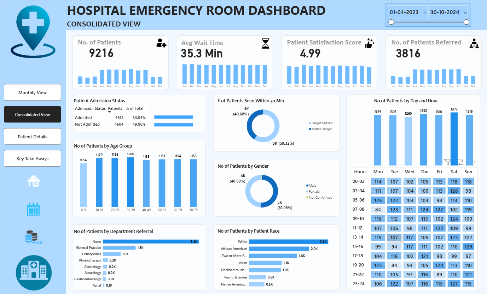

# Hospital-Emergency-Room-Analysis-Dashboard

Hospital Emergency Room Analysis Dashboard developed using Power BI to monitor patient flow, operational efficiency, wait times, referrals, and patient satisfaction.

## Project Overview

This project analyzes Emergency Room (ER) operations using healthcare data collected over a 19-month period. The dashboard provides insights into patient admissions, referrals, demographics, wait times, and overall hospital performance to support data-driven decision-making.

## Tools & Technologies

- Power BI
- Power Query
- DAX
- Data Modeling
- Data Visualization

## Dataset Information

| Metric | Value |
|----------|----------|
| Total Patients | 9,216 |
| Analysis Period | Apr 2023 – Oct 2024 |
| Average Wait Time | 35.3 Minutes |
| Average Satisfaction Score | 4.99 / 5 |
| Total Referrals | 3,816 |
| Admission Rate | 50.04% |

## Business Objective

The objective of this project is to:

- Monitor Emergency Room performance.
- Analyze patient admission trends.
- Track patient wait times and satisfaction scores.
- Identify peak demand periods.
- Evaluate referral patterns and department workload.
- Support operational and resource planning decisions.

## Dashboard Features

### Consolidated View

- Total Patients
- Admission Status
- Wait Time Analysis
- Satisfaction Score Tracking
- Gender Distribution
- Age Group Analysis
- Referral Department Analysis

### Monthly View

- Monthly Patient Trends
- Wait Time Monitoring
- Admission Analysis
- Referral Tracking
- Performance KPIs

### Patient Details View

- Patient-Level Information
- Demographic Analysis
- Admission Status
- Referral Information

### Key Takeaways

- Operational Performance Summary
- Patient Flow Insights
- Resource Utilization Analysis
- Department-Level Trends

## Dashboard Preview

### Consolidated Dashboard

[](https://github.com/Vishnu-Sai-bit/Emergency-Room/blob/main/Screenshots/Consolidated.png)

### Monthly View Dashboard

[](https://github.com/Vishnu-Sai-bit/Emergency-Room/blob/main/Screenshots/Monthly%20View.png)

### Patient Details Dashboard

[](https://github.com/Vishnu-Sai-bit/Emergency-Room/blob/main/Screenshots/Patient%20Details.png)

### Key Takeaways Dashboard

[](https://github.com/Vishnu-Sai-bit/Emergency-Room/blob/main/Screenshots/Key%20Takeaways.png)

## Key Insights

- Analyzed 9,216 patient records across a 19-month period.
- Average patient wait time was 35.3 minutes.
- Patient satisfaction score averaged 4.99 out of 5.
- More than 3,800 referrals were recorded across departments.
- Admission rate remained balanced at approximately 50%.
- Dashboard enabled monitoring of patient flow and operational efficiency.

## Project Workflow

1. Data Collection
2. Data Cleaning using Power Query
3. Data Modeling
4. DAX Measure Creation
5. KPI Development
6. Dashboard Design
7. Data Visualization
8. Insight Generation

## Repository Structure

```text
Hospital-Emergency-Room-Analysis-Dashboard
│
├── Dashboard
├── Data
├── Screenshots
├── assets
├── Data Terminology.docx
├── Hospital Emergency Room PPT.pptx
└── README.md
```

## Key Skills Demonstrated

- Healthcare Analytics
- Data Analysis
- Data Cleaning
- Data Modeling
- Power Query
- DAX
- Dashboard Development
- KPI Reporting
- Business Intelligence
- Data Visualization
- Operational Analytics

## Business Value

This dashboard helps healthcare administrators monitor Emergency Room performance, identify operational bottlenecks, improve patient experience, optimize resource allocation, and support informed decision-making.

## Author

**Beere Vishnu Sai**

LinkedIn: https://www.linkedin.com/in/beerevishnusai

GitHub: https://github.com/Vishnu-Sai-bit
